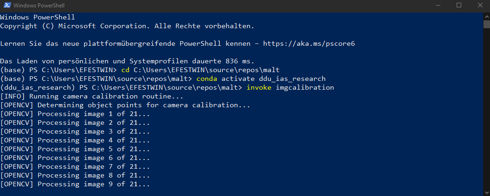

# `malt` submodule for image processing using OpenCV

## Getting started with image processing and contour detection

This guide explains how to get started with image processing, especially
contour detection using `malt`. Please read the guide *carefully* and until
the end. The last section provides some useful tips for working with Hops and
the componentserver.

### 1. Image directories

#### 1.1 Default directories

For convenience reasons, this directory contains a number of "magic"
directories to read and write image files during contour detection.

- `imgs_chessboard`: This is the directory for the chessboard calibration.
Place all images that you want to use for the chessboard calibration in this
folder as `.jpg` files!
- `imgs_raw`: This is the directory for the source images for undsitortion.
Place all images that you want to use for contour detection here (directly from
the camera) as `.jpg`files!
- `imgs_undistorted`: This is the directory where the undistortion routine will
write the undistorted images to. Do *NOT* place images here manually. The
undistorted output images will end up here automagically. After undistortion,
these are the files to perform contour detection on!

#### 1.2 Modifying the default directories

The default directories and files to be used are defined in
[imgprocessing.py](imgprocessing.py#L19) and can be changed there. It is also
possible to use [symlinks](https://learn.microsoft.com/en-us/windows-server/administration/windows-commands/mklink)
(directory junction) in place of the default directories.

### 2. Computing the camera matrix and coefficients

The first preparation step for contour detection is computing the camera matrix
and coefficients using chessboard calibration. **Make sure all your images for
chessboard calibration are stored in the `imgs_chessboard` directory!**

For completeness reasons, start by `cd` into *YOUR* `malt` repository
directory. For me that's running
```
cd C:\source\repos\malt
```

If you don't have done so already, activate the conda environment
```
conda activate ddu_ias_research
```

Now you're ready! For performing the chessboard calibration you just need to
run
```
invoke imgcalibration
```

*Alternatively, you can also pass your own input directory and/or coefficient
file like this:*
```
invoke imgcalibration --indir C:\my\chessboard\directory --coeffs C:\my\coeff\file.yml
```

...and you should end up with something like this:



*Additional Info: The camera matrix and coefficients will be saved in the
`coefficients.yml` file. Usually you shouldn't need to worry about that.*

### 3. Computing the undistorted images

The next step is to compute the undistorted images, using the camera matrix
and coefficients obtained during the previous step. **Make sure all your source
images are stored in the `imgs_raw` directory! Also, the `imgs_undistorted`
directory should be empty to avoid overwriting previous results or something.**

Performing the undistortion is fairly straight forward (nerds would say it's
easy as π). You can just run
```
invoke imgundistortion
```

*Alternatively, you can also pass your own input and output directory and/or
coefficient file like this:*
```
invoke imgundistortion --indir C:\my\input\directory --outdir C:\my\output\directory --coeffs C:\my\coeff\file.yml
```

...and you should end up with something like this:


### 4. Computing the transformation matrix for camera perspective

The next step is to compute the transformation matrix of the camera
perspective. This is done to ensure that the physical working area always maps
to a defined rectangle in digital space. For this step, it is required that
you know the measurements of the physical working area in millimeters (!).
By default, the first undistorted image from the default (!) directory for
saving the undistorted images is taken as a sample for this step.

Once you know the *width* and *height* of the physical working area, you can
just run
```
invoke imgperspective --width 1131 --height 1131
```

*Alternatively, you can also pass your own image sample file and/or file
for storing the perspective transformation matrix like this:*
```
invoke imgperspective --width 1131 --height 1131 --img C:\my\undistorted\image.jpg --xform C:\my\xform\file.yml
```

*NOTE: Here, the width and height are both set to 1131 mm, like in our last
experiment.*

A window should open:
- **Click the corners of the working area and then press Enter.**
- The order in which you click the corners is irrelevant.
- Clicked points will be marked with a red dot.
- You can zoom the image.
- **You can not edit. If you have misclicked, you have to run the
imgperspective routine again!**

It should look something like this:


*Additional Info: The perspective transformation matrix will be saved in the
`xform.yml` file. Usually you shouldn't need to worry about that.*

### 5. Running the actual contour detection (finally...)

Once you have completed all previous steps, you are ready to run the actual
contour detection in Grasshopper. First you need to start the componentserver
by running
```
python componentserver.py
```

Once the server is running, you can open `22XXXX_MALT_ContourDetection.gh`
from the `gh_dev` directory. It should then look something like this:


### 7. Hops and componentserver troubleshooting

- If something weird happens in the console while running the server, you can 
always abort and kill the running script by pressing `Strg + C` on your
keyboard. If still nothing happens, do that a couple of times.
- If a Hops component in Grasshopper is not refreshing but the componentserver
is running correctly, try double-clicking the Hops component. A window for
setting the Path will open. Don't change anything here and just click Ok. The
component should now initialize again.
- To manually refresh a Hops component in Grasshopper, select the component,
then press `Strg + Space` to bring up the circular menu and click "Enable".
The component should then send the current request to the server again.
